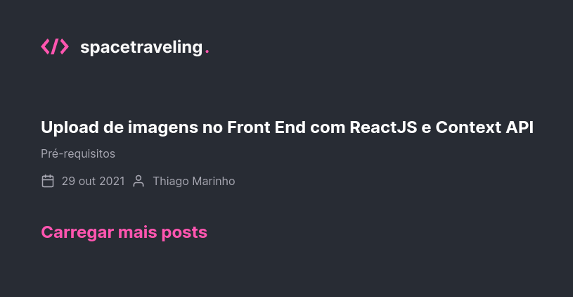
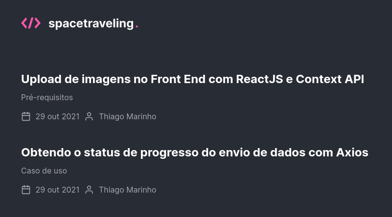
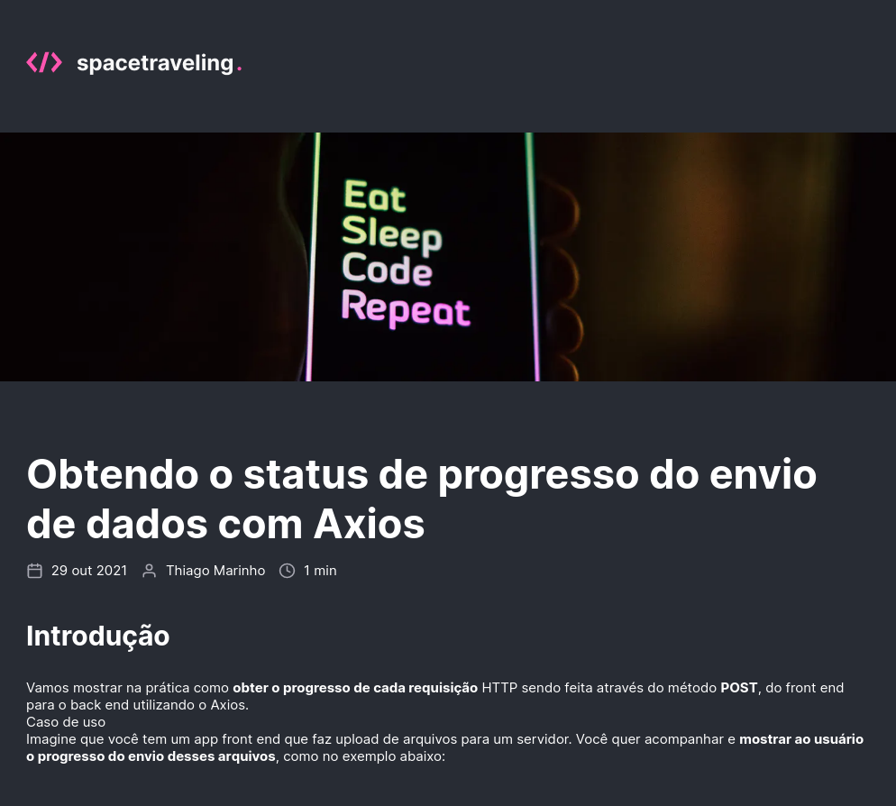

# spacetraveling

Blog application using ReactJS developed in the Rocketseat Ignite course using Prismac CMS.

## Technologies

Technologies used to build the application

- [ReactJS](https://reactjs.org/)
- [NextJS](https://nextjs.org/)
- [TypeScript](https://www.typescriptlang.org/)
- [SASS](https://sass-lang.com/)
- [Prismic CMS](https://prismic.io/)

## Screenshots

<div align="center" id="top"> 
  
</div>
<br/>
<br/>
<div align="center" id="top"> 
  
</div>
<br/>
<br/>
<div align="center" id="top"> 
  
</div>
<br/>
<br/>

```bash
# Clone this project
$ git clone https://github.com/ewertonspezia/spacetraveling

# Access
$ cd spacetraveling

# Install dependencies
$ yarn

# Adjusting variables in the .env.local file
$ Copy .env.local.example to .env.local and fill the variables

# Run the project
$ yarn dev

# The server will initialize in the <http://localhost:3000>
```
